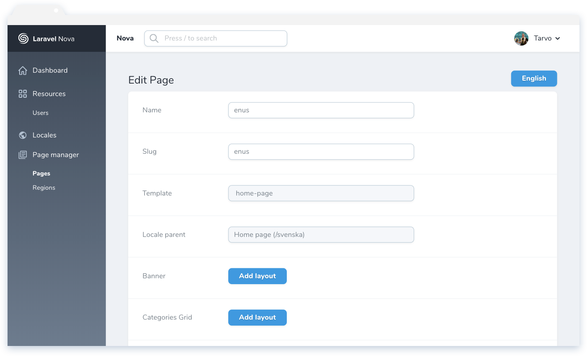

# Nova Locale Field

This [Laravel Nova](https://nova.laravel.com) package allows you to manage multiple localisations of a model.

## Screenshots





## Installation

Install the package in a Laravel Nova project via Composer:

```bash
composer require optimistdigital/nova-locale-field
```

## Usage

### Preparing the models and database

This field requires database changes - namely, the model requires two new columns. The names of the columns can be of your own liking, as they're configured when creating the field.

Firstly, a text column for the locale is needed. Maximum size depends on which types of locales you use (ie `en` vs `en_US`). This should NOT be nullable.

Secondly, a parent reference column is needed (essentially a foreign key, but having an actual foreign key is not required). If using Laravel's default unique identifiers for the models, it's type is `bigInteger`. This should be nullable.

```php
Schema::table('some_model_table', function ($table) {
    $table->string('locale');
    $table->bigInteger('locale_parent_id')->nullable();

    // Optionally, add a foreign key
    $table->foreign('locale_parent_id')->references('id')->on('some_model_table');
});
```

### Creating the field

There's nothing special in the way this field is used besides having different constructor (`::make(...)`) arguments.

The first argument is the displayed name of the locale field visible to the user that is displayed as the column title in the index field and as the locale select field.

The second argument is the attribute name for the locale (same as your table column name).

The third argument is the attribute name for the locale parent ID (same as your table column name).

```php
use OptimistDigital\NovaLocaleField\LocaleField;

LocaleField::make('Locale', 'locale', 'locale_parent_id')
    ->locales(['en' => 'English', 'et' => 'Estonian'])
    ->maxLocalesOnIndex(4)
```

## Options

Possible options you can pass to the field using the option name as a function, ie `->maxLocalesOnIndex(4)`.

| Option              | type  | default | description                                                                                                          |
| ------------------- | ----- | ------- | -------------------------------------------------------------------------------------------------------------------- |
| `locales`           | array | []      | Locales in an array as key-value pairs (`['id' => 'value']`).                                                        |
| `maxLocalesOnIndex` | int   | 4       | The amount of locales shown on the index view. If this is exceeded, the locales are only visible on the detail view. |

## Configuration

### Config file

You can publish the config file and edit the default values (besides locales) there.

To publish the configuration file, run the following artisan publish command:

```bash
php artisan vendor:publish --provider="OptimistDigital\NovaLocaleField\FieldServiceProvider" --tag="config"
```

### Default locales

The default locales can be defined using the `LocaleField::getLocales(Closure $closure)` function, preferably in `NovaServiceProvider`'s `boot()` function.

This default value can be overriden using the `->locales([])` function directly on the field.

For example:

```php
// in app/Providers/NovaServiceProvider.php

public function boot()
{
    \OptimistDigital\NovaLocaleField\LocaleField::getLocales(function() {
        return [
            'en' => 'English',
            'et' => 'Estonian',
        ];

        // Or for example do a query:
        // return Locales::all()->pluck('name', 'slug');
    });
}
```

## Credits

- [Tarvo Reinpalu](https://github.com/Tarpsvo)

## License

This project is open-sourced software licensed under the [MIT license](LICENSE.md).
